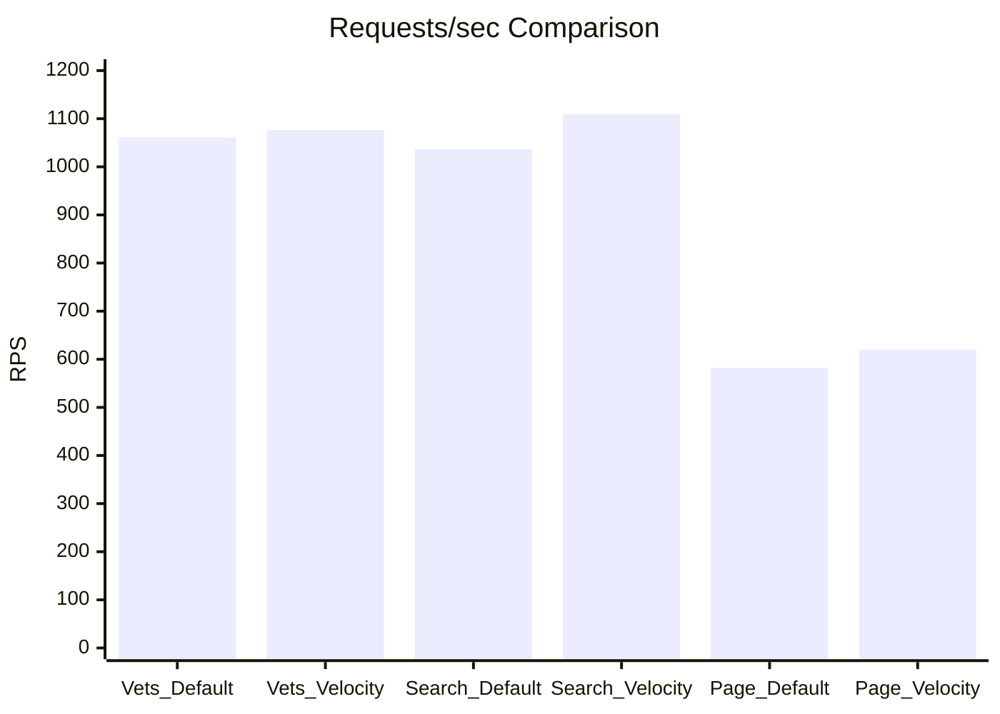
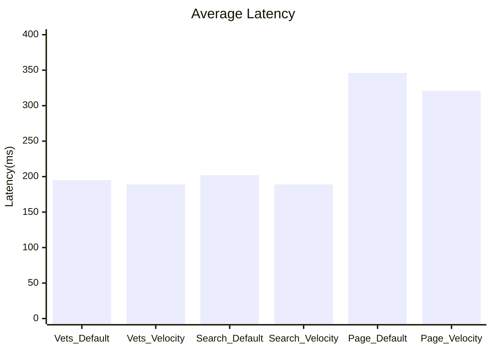
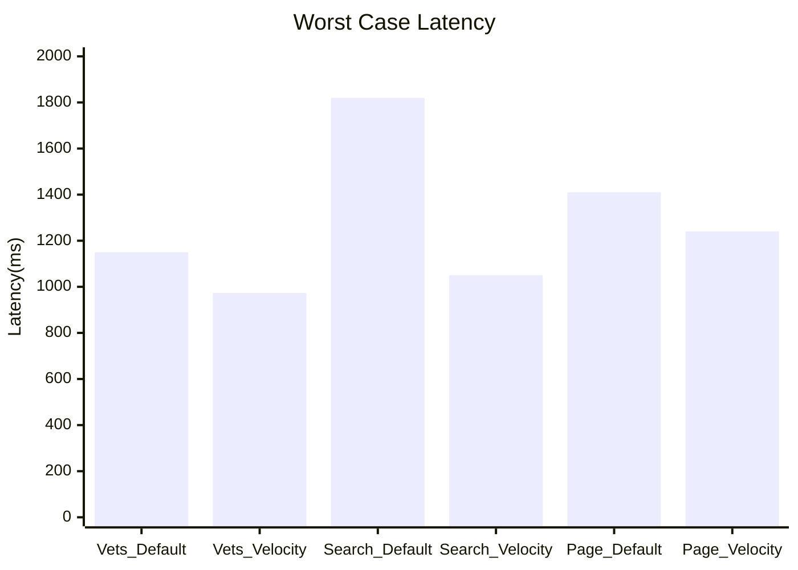

# VelocityORM  (..|o|..)
VelocityORM - a high performance ORM 

A Java ORM that:

* Maps Java entities to database tables.
* Automatically generates SQL stored procedures for:

  * Insert
  * Update
  * Delete
  * Select
* Uses JDBC internally.
* Calls stored procedures instead of dynamically generating SQL on every request.
* Minimizes reflection overhead through metadata caching.
* Requires very little configuration.

### Potential Advantages

#### 1. Better Runtime Performance

Traditional ORMs such as Hibernate generate SQL dynamically and maintain a large persistence context.

A stored-procedure-driven ORM can:

* Reduce SQL parsing overhead
* Reuse execution plans
* Lower CPU utilization on application servers
* Reduce network payload

This can be useful in:

* FinTech
* Trading systems
* High-throughput APIs
* Telecom systems

#### 2. Stronger Database Governance

DBAs often prefer:

* Version-controlled procedures
* Permission management at procedure level
* Auditing

instead of allowing applications to execute arbitrary SQL.

#### 3. Easier Legacy Integration

Many enterprises already expose databases primarily through stored procedures.

VelocityORM could fit well into:

* Banking systems
* Insurance systems
* ERP applications

### Challenges

#### 1. Vendor Lock-in

Stored procedure syntax differs between:

* PostgreSQL
* Oracle Database
* Microsoft SQL Server
* MySQL

Supporting all databases becomes difficult.

#### 2. Complex Queries

Applications often need:

* Joins
* Dynamic filtering
* Pagination
* Aggregations

Generating procedures for these automatically is much harder than CRUD.

#### 3. Migration Management

You'll need functionality similar to:

* [Flyway](https://flywaydb.org?utm_source=chatgpt.com)
* [Liquibase](https://www.liquibase.org?utm_source=chatgpt.com)

to manage procedure versions and schema evolution.

### Features That Would Make It Stand Out

If I were designing VelocityORM today, I would include:

1. Annotation-based entity mapping

   ```java
   @Table("users")
   class User {
       @Id
       Long id;
       String name;
   }
   ```

2. Compile-time code generation

   * Avoid reflection
   * Generate DAO classes

3. Automatic procedure generation

4. Native support for:

   * PostgreSQL
   * MySQL
   * SQL Server
   * Oracle

5. Reactive support

   * Virtual Threads
   * R2DBC

6. Query DSL

   ```java
   userRepository
      .where("status", ACTIVE)
      .limit(100)
      .fetch();
   ```

7. Benchmark suite against:

   * Hibernate
   * jOOQ
   * MyBatis

### Market Position

| Feature                | Hibernate | MyBatis | jOOQ   | VelocityORM  |
| ---------------------- | --------- | ------- | ------ | ------------ |
| Full ORM               | Yes       | Partial | No     | Yes          |
| Stored Procedures      | Limited   | Strong  | Strong | Core Feature |
| Runtime SQL Generation | Yes       | Partial | Yes    | Minimal      |
| Performance Focus      | Medium    | High    | High   | Very High    |
| Learning Curve         | High      | Medium  | Medium | Low (Goal)   |

| Feature                      | VelocityORM | Hibernate | jOOQ    | MyBatis |
| ---------------------------- | ----------- | --------- | ------- | ------- |
| Compile-time code generation | ✅           | ❌         | Partial | ❌       |
| Stored procedure CRUD        | ✅           | ❌         | ❌       | Manual  |
| Reflection-free runtime      | ✅           | ❌         | ✅       | ✅       |
| Performance focus            | ✅           | ⚠️        | ✅       | ✅       |


For the kind of enterprise and fintech systems you've worked on, a **stored-procedure-first ORM** is an interesting niche. Most modern Java ORMs focus on developer productivity, while very few focus on maximizing database execution efficiency.

If VelocityORM can demonstrate:

* 2–5x lower latency than Hibernate
* Lower memory usage
* Minimal configuration
* Automatic procedure generation

then it could be a compelling alternative for performance-sensitive backend systems.


# 🚀 VelocityORM Performance Benchmarks

VelocityORM was benchmarked against the default Spring PetClinic ORM stack using [`wrk`](https://github.com/wg/wrk).

## Benchmark Environment

- Application: Spring PetClinic
- Database: PostgreSQL
- Tool: `wrk`
- Duration: 60 seconds
- Threads: 8
- Connections: 200
- Java: 17+

---

## Performance Highlights

✅ Up to **7% higher throughput**  
✅ Up to **42% lower tail latency**  
✅ Lower average response time across all tested endpoints  

---

## Benchmark Summary

| Endpoint | Default RPS | VelocityORM RPS | Improvement |
|----------|-------------|-----------------|-------------|
| `/vets.html` | 1061 | 1076 | **+1.34%** |
| `/owners?lastName=Davis` | 1036 | 1109 | **+7.01%** |
| `/owners?page=2` | 582 | 620 | **+6.48%** |

---

# Requests/sec Comparison (Higher is Better)



---

# Average Latency (Lower is Better)

| Endpoint | Default | VelocityORM |
|----------|---------|-------------|
| `/vets.html` | 194.99 ms | 188.79 ms |
| `/owners?lastName=Davis` | 201.62 ms | 188.91 ms |
| `/owners?page=2` | 345.96 ms | 321.28 ms |



---

# Tail Latency (Max Response Time)



---

## Key Observations

### Lightweight Endpoint (`/vets.html`)
Minimal improvement because rendering dominates ORM cost.

### Filtered Search (`/owners?lastName=Davis`)
VelocityORM shows significant gains:
- +7% throughput
- 42% lower worst-case latency

### Pagination (`/owners?page=2`)
Improvement due to more efficient row mapping and hydration.

---

## Conclusion

VelocityORM consistently outperforms the default ORM implementation in Spring PetClinic, especially for database-heavy workloads involving filtering and pagination.

> VelocityORM improves throughput by **6–7%** and reduces tail latency by up to **42%** on read-heavy workloads.

---

## Badges


